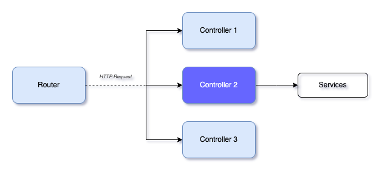

# Controllers


Controllers are responsible for handling incoming `requests` and returning `responses` to the client.

### Generate
To generate a controller you may below commands first one will create a `comments` controller just into `/`src` whereas the second `will create `a comments` controller at` `/src/post`

```shell
$ niom go co comments #co for controller
$ niom go co comments post 
```

### Explanation
Post controller implementing an interface with CRUD operations for a "post" model. It uses the Fiber web framework and a logger and response package for logging and handling HTTP responses. Let's walk through the code


```go
import (
	"github.com/go-niom/niom-sample/pkg/logger"
	"github.com/go-niom/niom-sample/pkg/response"
	dto "github.com/go-niom/niom-sample/src/post/dto"
	user "github.com/go-niom/niom-sample/src/post/model"
	"github.com/gofiber/fiber/v2"
)
```
The code imports necessary packages and dependencies, including the logger, response, DTO and model packages for the "post" entity. Import may be auto-generated while coding in `vscode` with help of recommended go extensions


```go
var PostController postControllerInterface = &postController{}

type postController struct {
}

type postControllerInterface interface {
	CreatePost(*fiber.Ctx) error
	GetAllPost(*fiber.Ctx) error
	GetPostById(*fiber.Ctx) error
	UpdatePost(*fiber.Ctx) error
	DeletePost(*fiber.Ctx) error
}
```

The code defines a struct for the post controller, implementing an interface with methods for each CRUD operation. The `postControllerInterface` specifies the interface with the `CreatePost`, `GetAllPost`, `GetPostById`, `UpdatePost`, and `DeletePost` methods.

```go
func (d *postController) CreatePost(ctx *fiber.Ctx) error {
	// method code
}
```

This method creates a new post with data from the HTTP request body, using a DTO to map the JSON to a struct. It returns a successful response with the created post or an error response if there was an issue creating the post.

```go
func (d *postController) GetAllPost(ctx *fiber.Ctx) error {
	// method code
}
```

This method gets all posts, optionally filtered by a query string parameter, and returns a success response with the list of posts or an error response if there was an issue retrieving the posts.

```go
func (d *postController) GetPostById(ctx *fiber.Ctx) error {
	// method code
}
```

This method gets a single post by ID and returns a successful response with the post or an error response if there was an issue retrieving the post.

```go
func (d *postController) UpdatePost(ctx *fiber.Ctx) error {
	// method code
}
```

This method updates a post by ID with data from the HTTP request body, using a DTO to map the JSON to a struct. It returns a successful response with the updated post or a no-content response if the update was successful but the response body is empty, or an error response if there was an issue updating the post.

```go
func (d *postController) DeletePost(ctx *fiber.Ctx) error {
	// method code
}
```

This method deletes a post by ID and returns a no-content response if the deletion was successful or an error response if there was an issue deleting the post.
