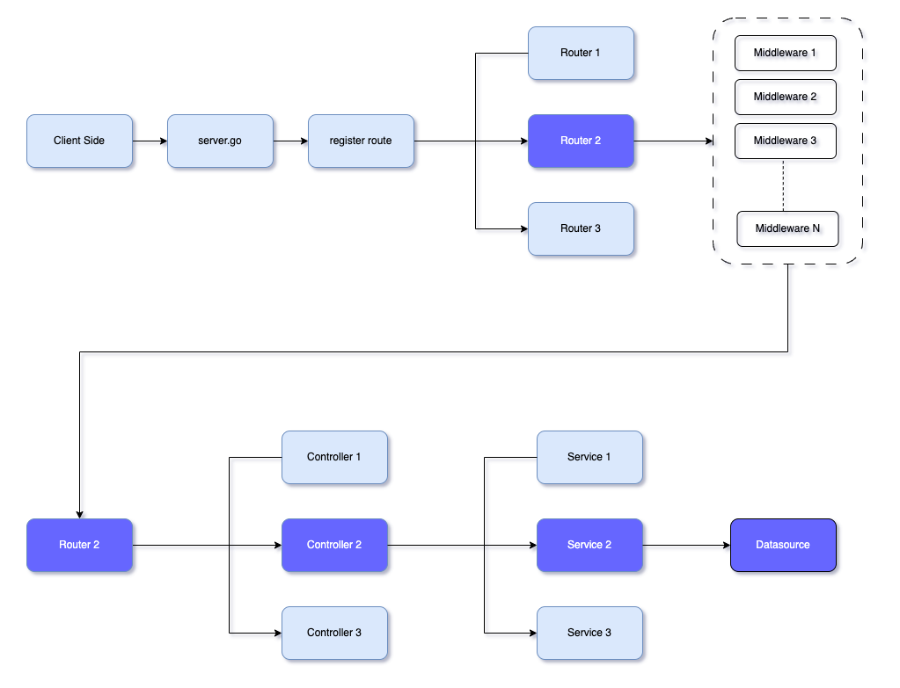

# In short (Architecture)

This article is meant to explain the architectural flow and flow event from client to data source and back. 

### Architectural Flow Diagram


## Main.go
The [main.go](https://github.com/go-niom/niom-sample/blob/master/main.go) is the entry point of the application.

```go
// @title Niom-Sample
// @version 1.0
// @description Niom-Sample Backend REST API
// @in header
// @name Authorization
// @host 127.0.0.1:7000
// @BasePath /api
func main() {

	// setup various configuration for app
	config.LoadAllConfigs(".env")
	server.Serve()
}
```
The comments above the main() is in Declarative Swagger Comments Format (DCF) you may read more about it [here](https://github.com/swaggo/swag#declarative-comments-format).

In short: Here we have done Swagger documentation for the API using annotations in the comments. The annotations start with the "@" symbol and provide information about the API's title, version, description, and authentication requirements. Specifically, the annotation "@in header" specifies that the authentication token should be provided in the header of the HTTP request.

```go
config.LoadAllConfigs(".env")
```
Loads all the necessary configurations for the app using the "config" package's "LoadAllConfigs" function. LoadAllConfigs load configs from the [`.env`](https://github.com/go-niom/niom-sample/blob/master/.env) file. The `.env`  file must be in the current directory or you may specify a custom path as `./dir/prod/prod.env`

```go
server.Serve()
```
The main function calls the Serve method from the server package to start the server and begin listening for incoming requests on the specified host and base path.

## Server Page
```
server/
┣ connecters.go
┣ middleware.go
┣ router.go
┗ server.go
```

## Server.go
In server.go there is Serve function. The Serve function starts a Fiber server, registers middleware and routers, and listens for incoming requests on a specified port and host.

```go
func Serve() {
	appCfg := config.AppCfg()

    // Define Fiber config & app.
	fiberCfg := config.FiberConfig()
	app := fiber.New(fiberCfg)
    // other things
}
```

The function begins by loading the configuration for the app using the AppCfg and FiberConfig functions from the [config](https://github.com/go-niom/niom-sample/tree/master/pkg/config) package. Then initialize the server app to serve.

```go
func Serve() {
    // ....other codes

    //initial the connecters
	initConnectors()

	//Attach Middleware
	registerMiddleware(app)
	registerRouters(app)

     // ....other codes
}
```
The `initConnectors()` from connecter.go may use to initialize the app-level connector such as logger, database, etc. The `registerMiddleware` you may use to register global middleware here we have initialized API logger to monitor the request whereas `registerRouters` may use to register child router and router level middleware. Complete code can be [here](https://github.com/go-niom/niom-sample/blob/master/server/server.go) which is well commented for self-understanding.