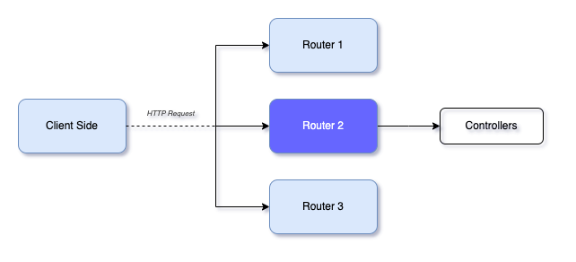

# Routers


Routers are responsible for determining how HTTP requests should be handled and which code should be executed to generate a response. 

### Generate
To generate a router you may below commands first one will create `comments` router just into `/src` whereas second will create `comments` router at `/src/post`

```shell
$ niom go ro comments #ro for router
$ niom go ro comments post 
```
Then you may need to add the router inside `registerRouters` in the file `niom-sample/server/router.go`. See below code snippet for reference.

```go 
func registerRouters(a fiber.Router) {
	//... other codes

	//Add Custom routers
	//... other routers
	comments.AppRouter(v1)
}

```
### Explanation
Router is entry point of the controller which accept the request from the client direct them for the controller for the action,.

Code Snippet of the router file:
```go
//src/post/post.router.go
func PostRouter(router fiber.Router) {

	route := router.Group("/post")
	route.Get("/", PostController.GetAllPost)
	route.Get("/:id", PostController.GetAllPost)
	route.Post("/", PostController.CreatePost)
	route.Patch("/", PostController.UpdatePost)
	route.Delete("/:id", PostController.DeletePost)
}
```
The `PostRouter` function takes a `fiber.` `Router` object as an input and creates routes for handling HTTP requests related to blog posts. Here is a breakdown of the individual routes:

- `route := router.Group("/post")`: Creates a new route group for handling requests related to blog posts, with the base URL path of "/post".

- `route.Get("/", PostController.GetAllPost)`: Adds a route for handling GET requests to the base URL path of "/post". It maps to the `GetAllPost` function in the `PostController` struct, which is responsible for returning a list of all blog posts.

- `route.Get("/:id", PostController.GetAllPost)`: Adds a route for handling GET requests to the URL path of "/post/:id". The `:id` part is a parameter that can match any value. It maps to the `GetAllPost` function in the `PostController` struct, which is responsible for returning a list of all blog posts.

- `route.Post("/", PostController.CreatePost)`: Adds a route for handling POST requests to the base URL path of "/post". It maps to the `CreatePost` function in the `PostController` struct, which is responsible for creating a new blog post.

- `route.Patch("/", PostController.UpdatePost)`: Adds a route for handling PATCH requests to the base URL path of "/post". It maps to the `UpdatePost` function in the `PostController` struct, which is responsible for updating an existing blog post.

- `route.Delete("/:id", PostController.DeletePost)`: Adds a route for handling DELETE requests to the URL path of "/post/:id". The `:id` part is a parameter that can match any value. It maps to the `DeletePost` function in the `PostController` struct, which is responsible for deleting a blog post.
